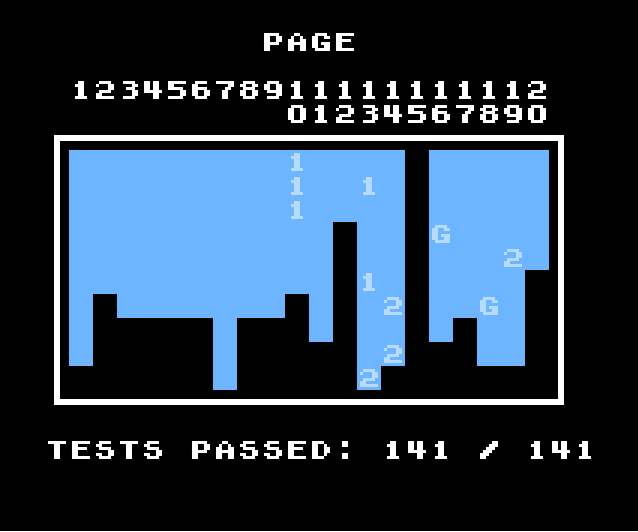

# CrabNes

[](https://github.com/ThisJackRN/CrabNes/actions/workflows/windows-build.yml)

CrabNes is a from-scratch NES and Famicom Disk System emulator written in Rust.
It combines a deterministic emulation core with a native Windows desktop
interface, responsive audio, long smooth rewind, TAS tools, speedrun-safe play
profiles, and RetroAchievements support.

> [!IMPORTANT]
> CrabNes supports the major Nintendo, Konami, Sunsoft, and Namco mapper families
> listed in the compatibility table below. Accuracy work is ongoing. No commercial
> ROMs or system BIOS files are included; use legally obtained games, BIOS dumps,
> or homebrew.

## Measured emulation accuracy

**CrabNes achieves a perfect 141/141 score on
[AccuracyCoin's](https://github.com/100thCoin/AccuracyCoin) NTSC NES accuracy
suite.**

<p align="center">
  
</p>

That makes CrabNes highly accurate by this measured standard, but no test suite
can cover every game, mapper, or hardware edge case. Emulation accuracy is an
ongoing effort: if something behaves differently from a real NES, please
[report it](https://github.com/ThisJackRN/CrabNes/issues) with the game or test
ROM, the behavior you expected, and what CrabNes did instead. Reproducible
reports help make the emulator better for everyone.

The score is updated only when it has been reproduced with the headless runner:

```powershell
cargo run --release -p nes-cli -- AccuracyCoin.nes --frames 12000 --press-start-at 120 --accuracycoin-report
```

During development, run only the affected one-based test page. The runner
navigates to that page, executes its built-in suite, and stops as soon as the
page finishes:

```powershell
cargo run --release -p nes-cli -- AccuracyCoin.nes --accuracycoin-page 13
```

Intermittent failures can be checked repeatedly in one emulator session:

```powershell
cargo run --release -p nes-cli -- AccuracyCoin.nes --accuracycoin-page 13 --accuracycoin-repeat 20 --frames 2500 --peek 0488
```

Use the complete 141-test command above once as the final regression check.

AccuracyCoin targets the RP2A03G CPU/APU and RP2C02G PPU used by NTSC NES
hardware. PAL support is tested separately because it uses different timing.

The library's per-ROM compatibility estimate statically follows likely 6502 code
from the ROM's reset, NMI, and IRQ vectors. It detects which PPU, APU, DMC, DMA,
and interrupt features that reachable code uses, applies only the relevant
AccuracyCoin risk, then adjusts for mapper and header uncertainty. Bank-selected
code that cannot be resolved statically remains covered by the mapper penalty.

## Download for Windows

Automated 64-bit Windows builds are available from GitHub Actions:

1. Open the [Windows build workflow](https://github.com/ThisJackRN/CrabNes/actions/workflows/windows-build.yml).
2. Select the newest successful run.
3. Download the `CrabNes-windows-x64` artifact.
4. Extract it and run `CrabNes.exe`.

Artifacts are retained by GitHub for 30 days. If no artifact is available yet,
run the workflow manually or [build from source](#build-from-source).

## What CrabNes includes

- Cycle-driven NTSC and PAL CPU, PPU, and APU emulation, including stable
  unofficial NMOS 6502 opcodes and observable dummy bus accesses.
- Cartridge IRQs, banked RAM/ROM, dynamic mirroring, and expansion audio.
- Famicom Disk System disk I/O, timer and transfer IRQs, writable disk data,
  multi-side images, save states, and wavetable expansion audio.
- Native low-latency Windows audio with per-channel controls.
- Keyboard and hot-pluggable gamepad support for two players.
- Searchable ROM library with custom titles, automatic RetroAchievements
  artwork, user-selected artwork overrides, and a per-ROM compatibility estimate
  weighted from likely reachable ROM code, measured AccuracyCoin categories,
  and cartridge mapper coverage.
- Per-game cheat manager for 6/8-letter NES Game Genie codes and raw CPU read
  patches, including disk-loaded FDS program RAM.
- Versioned save states with screenshots and ROM validation.
- LZ4-compressed rewind: two minutes by default, configurable up to ten minutes.
- TAS recording, playback, rerecording, frame editing, seeking, and checkpoints.
- FCEUX `.fm2` and BizHawk `.bk2`/`Input Log.txt` movie import, including
  checksum-checked embedded FCEUX MMC3 start states.
- Debugger, guarded hex editor, custom palettes, and optional CRT rendering.
- Standard, Speedrun, and Achievement play profiles.
- RetroAchievements sign-in, badge artwork, progress, unlock archive, and
  animated in-game notifications.

## Play profiles

Choose a profile under **Settings > General**.

| Profile | Intended use | Emulator assists |
|---|---|---|
| Standard | Normal play, debugging, and TAS work | Available |
| Speedrun | Clean real-time runs at normal speed | Disabled |
| Achievements | RetroAchievements play at normal speed | Disabled |

Speedrun and Achievement profiles lock the emulator to 1x and remove pause,
frame advance, rewind, save states, TAS tools, debugger/hex editing, impossible
D-pad combinations, and their hotkeys. Reset, power controls, input mapping,
screenshots, and presentation settings remain available.

### RetroAchievements status

CrabNes vendors the official rcheevos 12.3.0 client. Networking and badge image
loading run off the emulation thread, while achievement evaluation uses a
side-effect-free memory snapshot once per emulated frame.

CrabNes is not yet an approved RetroAchievements client. Normal account sign-in,
game identification, sets, badges, progress, and unlock UI work, but the service
does not award hardcore unlocks to an unknown emulator. The Achievements window
pins client and game-version limitations as warnings instead of presenting them
as game achievements or unlock notifications.

On startup and whenever the library is refreshed, CrabNes scans new ROMs and
caches artwork for games recognized by RetroAchievements. This happens in the
background without launching the game or signing in. Use **Set Custom
Artwork…** from a library entry's menu to override it; removing the custom image
restores the cached one.

## Compatibility

| Area | Current support |
|---|---|
| Region | NTSC and PAL; standard Europe/Australia/PAL filename tags correct legacy ROMs with missing timing flags; multi-region NES 2.0 images default to NTSC |
| ROM format | iNES 1.0 and NES 2.0 for supported boards; headered and headerless `.fds` disk images |
| Mapper | 0 NROM; 1 MMC1; 2 UxROM; 3 CNROM; 4 MMC3; 5 MMC5; 7 AxROM; 9 MMC2; 10 MMC4; 19 Namco 163; 20 Famicom Disk System; 21/22/23/25 VRC2/VRC4; 24/26 VRC6; 69 FME-7/5B; 85 VRC7; 99 Nintendo Vs. System |
| Expansion audio | Famicom Disk System wavetable, Sunsoft 5B, VRC6, Namco 163, MMC5, and VRC7 FM |
| Desktop | Windows x64 |
| Controllers | Two NES controllers through keyboard and gamepads |
| Battery data | Cartridge RAM and writable FDS disk data in a `.sav` beside the game image |
| Save states | Versioned, validated, and separated by ROM hash |

The PPU models rendering-time VRAM increments, palette bus behavior, VBlank/NMI
suppression, OAM access restrictions, grayscale masking, and timed sprite
overflow, but is not yet dot-perfect for every sprite-evaluation and
fetch-pipeline quirk. MMC5 extended attributes and vertical split rendering,
exact VRC7 FM operator/envelope behavior, and unusual board variants still need
accuracy work. Dendy timing, light guns, Four Score, and cartridge families
outside the table are not implemented yet.

## Famicom Disk System setup

FDS games require both a `.fds` disk image and the Famicom Disk System BIOS.
CrabNes does not distribute the copyrighted BIOS. Dump it from hardware you own
and select the resulting, exactly 8 KiB (8192-byte) `disksys.rom` file under
**Settings > Paths > Choose FDS BIOS…**.

If no BIOS has been selected, the desktop application also looks for
`disksys.rom` in the current working directory and beside the `.fds` image. FDS
images in the configured ROM folder appear in the searchable library even when
they have no cover artwork; they can also be opened through **File > Open ROM…**
or `Ctrl+O`. Side A starts inserted. Press `6` once to eject the disk and again
to insert the next side; multi-side images wrap back to the first side. The
keyboard and gamepad bindings can be changed under **Settings > Input > Famicom
Disk System controls**.

Disk writes are persisted in a `.sav` beside the `.fds` image. Save states retain
the complete drive, disk, timer, IRQ, and FDS audio state. Keep backups of the
original disk image and save data when testing software that writes to disk.

The headless runner accepts the BIOS explicitly:

```powershell
cargo run --release -p nes-cli -- path\to\game.fds --fds-bios path\to\disksys.rom --frames 1200 --screenshot fds.png
```

## Video output and overscan

The presentation settings include independent **Crop 8px vertical overscan** and
**Crop 8px horizontal overscan** options. Vertical cropping is enabled by default;
horizontal cropping is disabled by default and can hide the edge pixels visible
in games such as Super Mario Bros. 3. Cropping affects only the displayed image,
and both native and CRT rendering preserve the visible area's aspect ratio and
integer-scaling dimensions.

Palettes are chosen in **Settings > Video** (or the quick **Audio / Video**
window): NTSC 2C02, RGB 2C03 / PlayChoice-10, RGB 2C04-0004 (Vs. System), or a
custom imported palette. Nintendo Vs. System (mapper 99) ROMs used a
scrambled-palette RGB PPU, not a home console's composite one, so the wrong
chip renders visibly wrong colors, not just different ones — Vs. System games
therefore always render with RGB 2C04-0004 unless that specific game has an
explicit palette override, regardless of the global setting used by every
other ROM. Pick a different palette for a Vs. game in **Per-game overrides >
Override palette** — shown in both the Settings window and the quick Audio /
Video window — and it sticks until the override is turned off again; see
[Custom palettes](docs/CUSTOM_PALETTES.md) for details.

## Controls

All gameplay bindings can be changed in **Settings > Input**.

| Default key | Action |
|---|---|
| Arrow keys | Player 1 D-pad |
| Z / X | Player 1 A / B |
| Shift / Enter | Player 1 Select / Start |
| I / J / K / L | Player 2 Up / Left / Down / Right |
| C / V | Player 2 A / B |
| Q / E | Player 2 Select / Start |
| Ctrl+O | Open ROM |
| Space | Pause or resume |
| R | Reset |
| P | Power off or on |
| Ctrl+P | Power cycle |
| 6 | FDS eject / insert next side |
| F5 / F8 | Quick save / quick load |
| N | Advance one frame |
| Backspace (hold) | Rewind |
| Tab (hold) | 4x fast-forward |
| Num0 | Return to 1x speed |
| F1 / F2 | Debugger / hex editor |
| F11 | Fullscreen |
| F12 | Screenshot |

Assist hotkeys are ignored in Speedrun and Achievement profiles. Hotkeys are
also ignored while typing in a text field.

Reset and power cycle restart the emulated frame counter at zero. Powering the
console off pauses emulation and displays a black screen; powering it on performs
a fresh reset.

## Cheat codes

While a game is running in the Standard profile, open **Tools > Cheat Codes…**.
Each game keeps its own named list, and enabled codes apply immediately and stay
active across reset, rewind, and save-state loads. Cheats are automatically
disabled in Speedrun and Achievement profiles.

CrabNes accepts standard six- and eight-letter NES Game Genie codes, with or
without hyphens. Eight-letter codes include an original-byte comparison, which
helps codes select the intended bank in bank-switched cartridges. Raw CPU read
patches use either `ADDRESS:VALUE` or `ADDRESS?COMPARE:VALUE`, with hexadecimal
numbers; for example, `6000:EA` or `810E?F0:10`.

FDS games can use both formats. Since FDS software is loaded into writable
program RAM rather than cartridge ROM, raw patches are usually more useful and
can target the full disk-loaded `$6000-$DFFF` range. Game Genie codes cover
`$8000-$FFFF`. Codes are specific to the game's region and revision.

You can watch codes work in real time. The Cheat Codes window shows a Live
activity row per code: a dot flashes whenever the console actually reads a byte
through the code, along with how many reads it has substituted and whether an
eight-letter code is still waiting for its compare value. The hex editor gains
a "CPU bus (game's view)" space showing the full 64 KiB address space exactly as
the running program sees it — patched bytes are drawn in green while actively
substituted (yellow while armed but waiting), with hover details, and every
activity row has a "Show in hex" button that jumps straight to the byte. The
hex editor normally pauses emulation while open; its "Live mode" checkbox (also
in Settings → Debugging) keeps the game running so the view refreshes every
frame and edits land between frames.

TAS movies treat cheats like a physical Game Genie plugged in before power-on:
starting a new recording locks the currently enabled codes into the movie, the
`.tas` file stores them, and playback reapplies them automatically. While a
movie is recording or playing the machine keeps the movie's codes; edits to the
per-game list take effect after the TAS stops. When converting FM2, BK2, or
BizHawk input logs, the TAS Control View asks whether to lock your enabled
codes into the converted movie (on by default) — the original inputs replay
through the codes as if a Game Genie were plugged in, which can change how the
run plays out.

FM2 conversions also default to FCEUX-compatible controller timing so FCEUX
movies replay without desyncing; see
[FCEUX compatibility mode](#fceux-compatibility-mode).

## Save states and rewind

Each game has ten save-state slots by default. States include the full CPU, PPU,
APU, mapper, controller, DMA, interrupt, power, timing, and framebuffer state.
They carry a ROM hash and format version, so incompatible states are rejected
before they can alter the running console.

Rewind stores periodic full-machine snapshots in a bounded, LZ4-compressed ring.
Compression happens on a background worker, and reverse playback uses a
drift-free 60 Hz schedule. Releasing Backspace resumes play when appropriate.

## TAS tools

The TAS editor records both controllers once per emulated frame. It supports
power-on, reset, and embedded-state starting conditions; read-only playback;
held input; insertion/deletion; range editing; bookmarks; rerecord counts; and
deterministic seeking through cached checkpoints.

Native `.tas` files are readable text and include the ROM SHA-256. CrabNes still
accepts movies created before the rename with the legacy emulator identifier.
See the [TAS format specification](docs/TAS_FORMAT.md) and
[TAS Control View guide](docs/TAS_CONTROL_VIEW.md).

## FCEUX compatibility mode

On a real front-loader NES, a DMC or OAM DMA cycle that overlaps a
`$4016`/`$4017` controller read clocks the controller shift register extra
times, corrupting that read. Games that use DMC audio — Super Mario Bros. 3 is
the classic case — defend themselves by re-reading the controller until two
reads agree, and those retries cost CPU time that occasionally produces an
extra lag frame. CrabNes emulates this corruption by default; AccuracyCoin's
"DMA + $4016 READ" and "CONTROLLER CLOCKING" tests verify it.

FCEUX never emulated the corruption, so FM2 movies were recorded against a
console where it does not exist. Played back on accurate hardware timing, their
inputs land one frame late after the first divergent lag frame and the run
desyncs. CrabNes therefore keeps both models and switches between them
automatically:

- **Normal play, native recordings, Speedrun and Achievement profiles** use the
  hardware-accurate model.
- **FM2 conversions** default to FCEUX-compatible timing (a checkbox in the TAS
  Control View). The converted movie records the choice as `JOYPAD_TIMING
  FCEUX` in its `.tas` file, playback applies it automatically, the TAS editor
  shows an "FCEUX pad timing" badge, and the hardware model returns the moment
  the TAS stops.
- **Settings > Emulation > Advanced accuracy** exposes the same switch
  globally for experiments outside movie playback. It applies to Standard-mode
  play, is captured into new TAS recordings you make while it is on, and never
  overrides a playing movie's own recorded setting. Restricted play profiles
  ignore it. Expect AccuracyCoin's controller-clocking tests to fail while it
  is enabled — that is the point of the switch.

## Settings and existing data

CrabNes stores user data under:

```text
%LOCALAPPDATA%\CrabNes\
  settings.json                 Global settings and play profile
  per-game-settings.json        ROM-specific presentation overrides
  library.json                  Library metadata and recent games
  library-covers\               Cached automatic and copied custom artwork
  achievement-archive.json      Local RetroAchievements unlock history
  palettes\                     Imported custom palettes
  states\<rom-hash>\             Save-state slots and previews
  tas\<rom-hash>\                Default TAS folder
```

Battery saves and screenshots remain beside the ROM.

## Build from source

Install the [stable Rust toolchain](https://www.rust-lang.org/tools/install).
Windows builds may also require the Visual Studio C++ Build Tools because the
native audio backend and rcheevos runtime include C code.

```powershell
git clone https://github.com/ThisJackRN/CrabNes.git
cd CrabNes
cargo test --workspace --locked
cargo run --release -p nes-ui --locked
```

You can pass a ROM path on the command line:

```powershell
cargo run --release -p nes-ui --locked -- path\to\game.nes
```

The included `Play CrabNes.bat` launcher runs the optimized desktop application.
The headless runner can be used for smoke tests and screenshots:

```powershell
cargo run -p nes-cli --locked -- path\to\game.nes --frames 120 --screenshot frame.png
```

Developers can run individual ROMs or recursive directories that use the
standard blargg `$6000` pass/fail protocol:

```powershell
cargo run -p nes-cli --bin crabnes-test-rom --locked -- path\to\test-roms
```

See the [test-ROM runner guide](docs/TEST_ROMS.md) for limits, exit behavior, and
the current cycle-scheduling accuracy boundary.

## Documentation

- [TAS movie format](docs/TAS_FORMAT.md)
- [TAS Control View and external movie conversion](docs/TAS_CONTROL_VIEW.md)
- [CRT filters](docs/CRT_FILTER.md)
- [Custom palettes](docs/CUSTOM_PALETTES.md)
- [Test ROM runner and timing status](docs/TEST_ROMS.md)
- [Third-party licenses and acknowledgements](THIRD_PARTY_NOTICES.md)

## Project layout

```text
crates/
  nes-core/                    Platform-independent emulation core
  nes-audio-native/            Native miniaudio output
  nes-achievements-native/     Safe Rust wrapper around vendored rcheevos
  nes-cli/                     Headless frame and test-ROM runners
  nes-ui/                      CrabNes desktop application
```

The core contains no window, input-device, filesystem, audio-device, or
wall-clock dependencies. Front ends decide how much emulated work to request;
they do not act as the emulation clock.

## Development checks

```powershell
cargo fmt --all -- --check
cargo test --workspace --locked
cargo clippy --workspace --all-targets -- -D warnings
cargo build --release --workspace --locked
```

## License

CrabNes is available under the [MIT License](LICENSE). Vendored libraries,
adapted permissive code, and interoperability references are documented in
[THIRD_PARTY_NOTICES.md](THIRD_PARTY_NOTICES.md).
